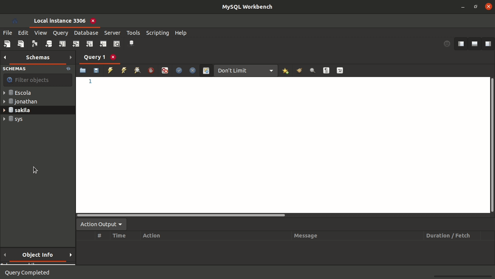
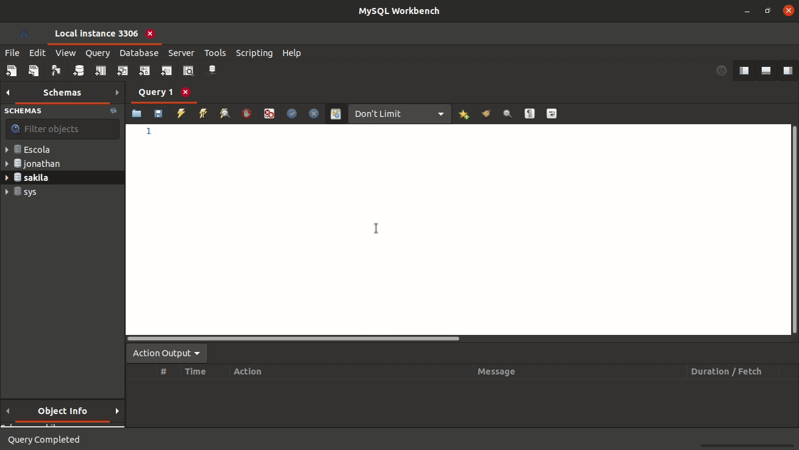
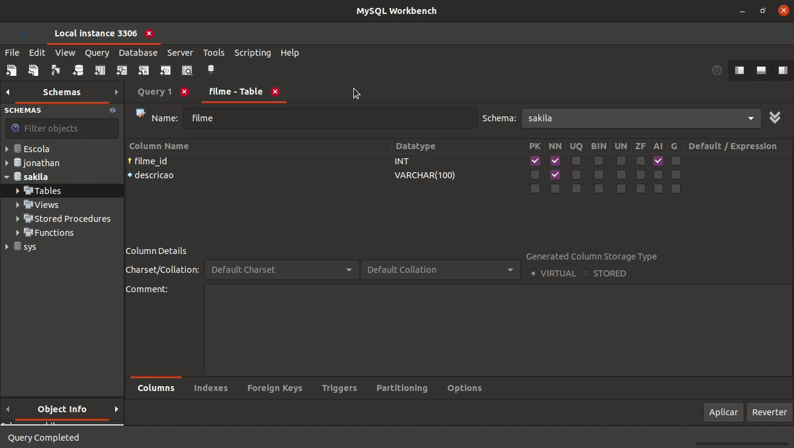
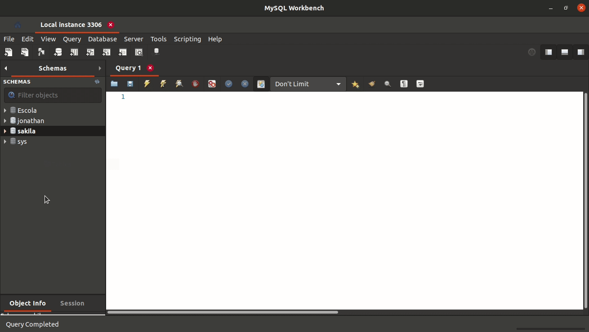
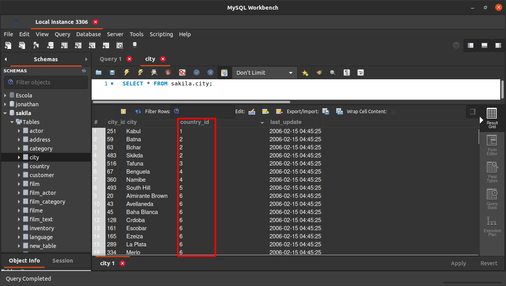
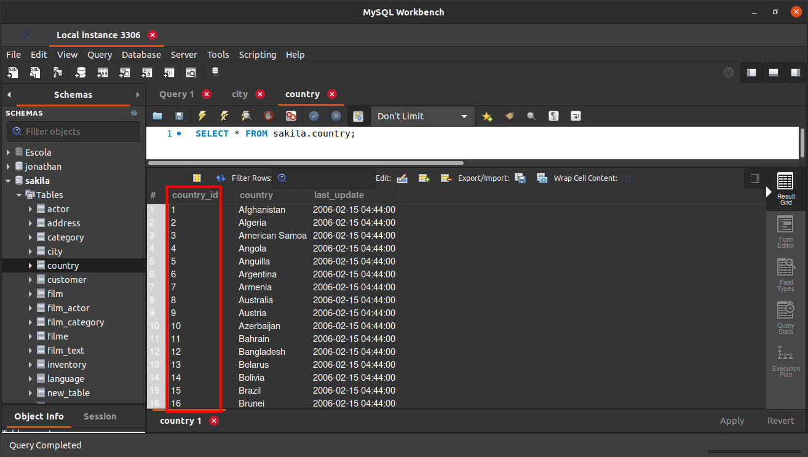
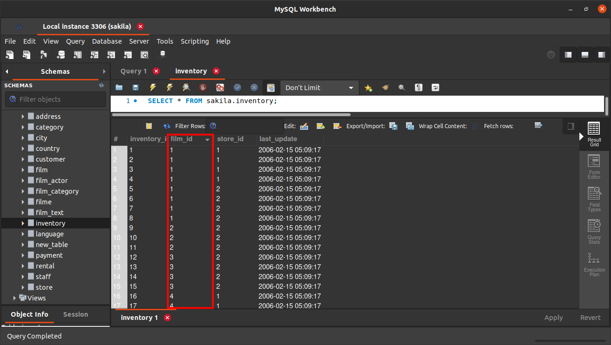
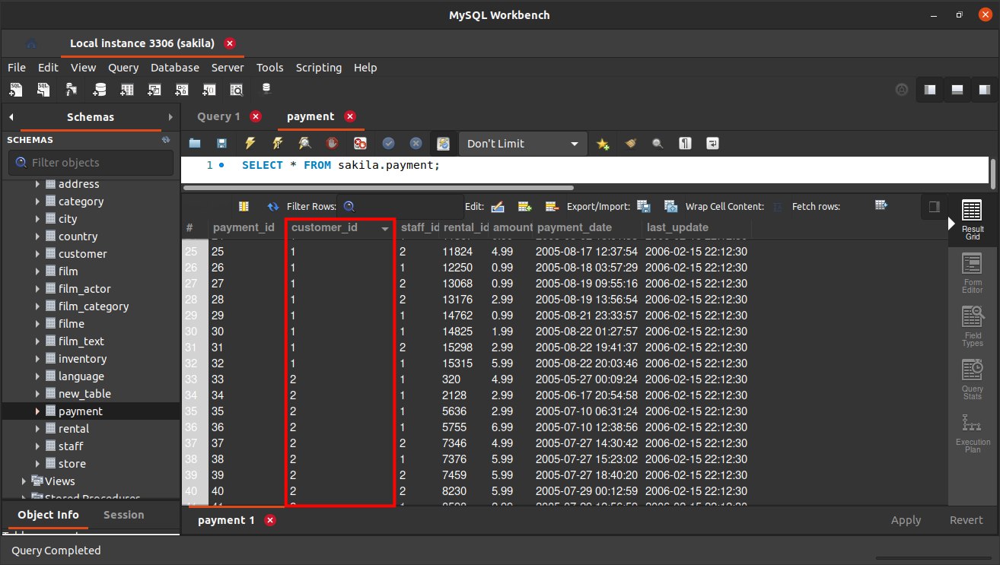
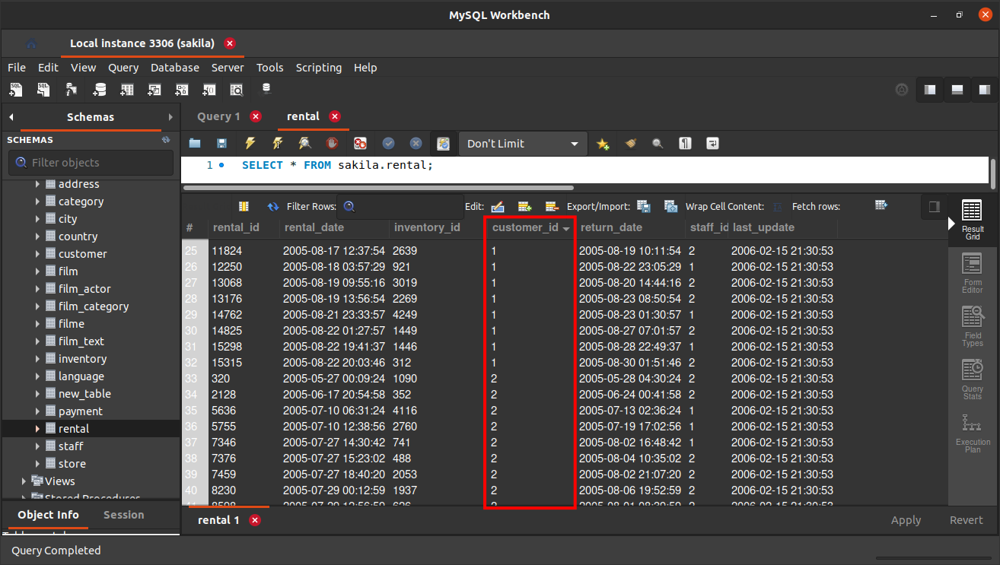

# Exercícios

Agora vamos abrir o Workbench e fazer uma análise prática do banco de dados sakila, que já deve estar instalado, caso você tenha feito a instalação do MySql Workbench de forma padrão. Caso o banco sakila não esteja disponível, volte até a seção Restaurando o banco de dados de prática sakila e siga as instruções listadas. Com esse banco disponível na sua instalação do Workbench, sua missão agora é tentar finalizar os exercícios a seguir!

1. Descubra como fazer uma pesquisa em qualquer tabela sem utilizar uma linha de código usando o MySql Workbench.

   __*Resposta:*__
   

2. Descubra como é possível criar uma tabela sem usar código SQL usando o MySql Workbench.

   __*Resposta:*__
   

3. Feito isso, crie uma tabela com as seguintes restrições: 
Nome da tabela: Filme: 
Colunas:
   * FilmeId - primary key, tipo int, incrementa por 1 cada vez que um valor é inserido automaticamente;
   * Descricao - não permite nulos, tipo texto (varchar(100));
   * AnoLancamento - não permite nulos, tipo int;
   * Nota - permite nulos, tipo int;

   __*Resposta:*__
   

4. Analise a tabela city e encontre a tabela à qual a coluna country_id faz referência.

   __*Resposta:*__
   Faz referência à tabela country
   

5. Após resolver o exercício anterior, responda: qual tipo de relacionamento a tabela city faz com a tabela country?

   __*Resposta:*__
   Muitos para um (N:1) porque muitas cidades podem pertencer a um mesmo país.
   

6. Qual tipo de relacionamento a tabela country faz com a tabela city?

   __*Resposta:*__
   Um para muitos (1:N) porque um país pode ter muitas cidades.
   

7. Abra tabela por tabela do banco sakila e encontre no mínimo 3 exemplos de um relacionamentos 1:N ou N:1.

   __*Resposta:*__

   Tabela inventory tem relação de muitos para um (N:1) com a tabela film.
   
   Tabela payment tem relação de muitos para um (N:1) com a tabela customer.
   
   Tabela rental tem relação de muitos para um (N:1) com a tabela customer.
   

### Esses exercícios foram feitos por [min](https://www.linkedin.com/in/jonathanrei5/) na [Trybe](https://www.betrybe.com/)
